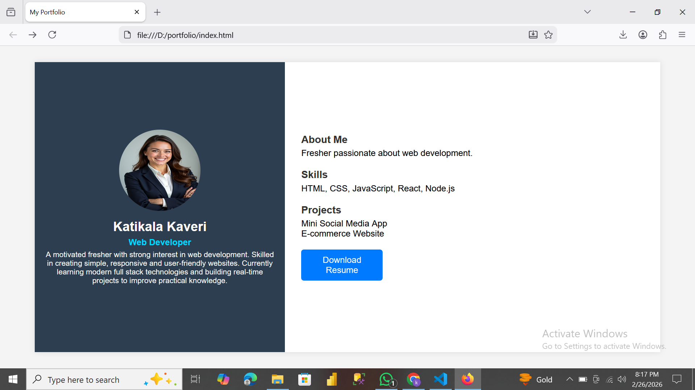

# CodSoft-Portfolio-Task1

### 📌 Project Title

**Personal Portfolio Website**

## 💼 Portfolio Website

This project is created as part of the **CodSoft Web Development Internship (Level 1 Task 1)**.

---

### 👩‍💻 Intern Details

**Name:** Katikala Kaveri
**Intern ID:** BY25RY270303
**Domain:** Web Development
**Organization:** CodSoft

---

### 📖 Project Description

This is a simple personal portfolio website developed using HTML and CSS.
The portfolio showcases basic personal and professional details in a clean and structured layout.

The website includes:

* Profile Photo
* Name & Role
* About Me Section
* Skills
* Projects
* Contact Information

This project helped in understanding the basics of:

* Website structure
* Layout design
* Styling using CSS
* Creating a responsive portfolio

---

### 🛠️ Technologies Used

* HTML
* CSS

---

### 📂 Project Files

* `index.html`
* `style.css`
* `photo.jpg`
* `page.png` (Output Screenshot)

---

### 🎯 Objective

To create a simple personal portfolio website as part of the CodSoft Internship Level 1 Task 1.

---

### 📸 Output Screenshot

Included in the repository as:

---

### ✅ Status

✔ Task Completed Successfully
